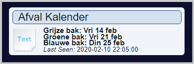

# Welcome to the GarbageCalendar wiki!

This is a project to retrieve the Garbage calendar information for your home address by means of  a Domoticz time script which will update a Domoticz TEXT device and optionally send you a notification at the specified time(s) 0-x days before the event. 
This repository is a replacement for the initial repository I started: https://github.com/jvanderzande/mijnafvalwijzer. 
The main changes are:
  * This repository is modular making it easier to maintain and add new website modules for other municipalities.
  * It has a single main script called **"script_time_garbagecalendar.lua"**
  * Subdirectory **"garbagecalendar"** contains all available modules for the supported municipality websites and your personal configuration file **"garbagecalendarconfig.lua"**.
  * The selected module scripts is ran one time per day in the background to get the website data and save that to a datafile.
  * This Data file is used by the mainscript at the requested times.
  * No hanging Domoticz event system, generating a "longer than 10 seconds" error when the website is unresponsive, as the Webupdate is running in the background in its own process.
  * The script has much more error checking and standard logging to make problem solving much simpler.
  * The main script can optionally create an ics calendar file which can be used by a calendar application.

#### Available topics:
  * [How does it all work](Process)
  * [Modules](Available_modules)
  * [Setup](Setup)
  * [Add own notification code](Notifications)
  * [Testing/debugging](Testing)
