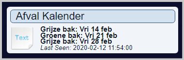
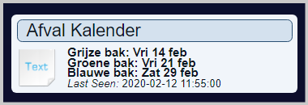

# Prerequisites
  * ***lua*** must be installed which can be checked by running the following command: ***lua -v***  
      Install lua52 in case it isn't installed yet.
  * ***curl*** must be installed which can be checked by running the following command: ***curl --version***  

# Setup
1. ### Domoticz
   In the hardware section of Domoticz; create Dummy and within the Dummy create a virtual Text sensor and remember the name you gave this virtual Text sensor. eg "Container".
1. ### Install scripts
   Download [the project zipfile](https://github.com/jvanderzande/GarbageCalendar/archive/master.zip)
    and unzip the main script **"script_time_garbagecalendar.lua"** and **"garbagecalendar"** directory **one** of these 2 directories:
   * ### **"domoticz/scripts/lua"** directory to use the standard LUA event system.
   -or-
   * ### **"domoticz/scripts/dzvents"** directory in case you want to run the script with **DzVents**  
2. ### Create personal config
   Go into directory **"garbagecalendar/"** and copy file **"garbagecalendarconfig_model.lua"** to **"garbagecalendarconfig.lua"** to create your personal config file.
   **"garbagecalendarconfig.lua"** will contain your personal setup and preferences used by the process. This file isn't updated when you upgrade the scripts from Github, so you will have to do this manually in case of changes/additions.
3. ### Update your personal configuration
   Edit the following information in file **"garbagecalendarconfig.lua"**:
   1. #### Domoticz & Address information:

      ```lua
      myGarbageDevice = ''  -- The Text devicename in Domoticz. eg 'Container'
      ShowNextEvents = 3    -- indicate the next x events to show in the TEXT Sensor in Domoticz
      Zipcode = ''         -- Your zipcode  eg '1234AB'
      Housenr = ''         -- Your housnr. eg '99'
      Housenrsuf = ''      -- Your housnr suffix  ('a', 'b'  etc)
      Hostname = ''        -- m_opzet & m_opzet_api: Specify the hostname of your website. eg 'inzamelkalender.hvcgroep.nl'
                           -- *m_ximmio: Specify the companycode. (See m_ximmio.lua on how to find this code).
      Street=''            -- Street name Only needed for: m_recycleapp
      ```

      **Required information per module:** (R=Required/O=Optional)
      |Module|Zipcode|Housenr|Housenrsuf|Hostname|Street|
      | --- | :---: | :---: | :---: | :---: | :---: |
      |m_deafvalapp |R|R|O|||
      |m_mijnafvalwijzer|R|R|O|||
      |m_Montferland|R|R|O|||
      |m_recycleapp|R|R|O||R|
      |m_omrin|R|R|O|||
      |m_opzet|R|R|O|R||
      |m_opzet_api|R|R|O|R||
      |m_rova_api|R|R|O|||
      |m_ximmio|R|R|O|R*||
      |m_zuidlimburg|R|R|O|||

   2. #### Modules
      choose one of these modules by removing the "--" in front of the modulename. eg for "mijnafvalwijzer":

      ```lua
      --websitemodule = "m_deafvalapp"
      websitemodule = "m_mijnafvalwijzer"
      --websitemodule = "m_montferland"
      --websitemodule = "m_recycleapp"
      --websitemodule = "m_omrin"
      --websitemodule = "m_opzet"
      --websitemodule = "m_opzet_api"
      --websitemodule = "m_rova_api"
      --websitemodule = "m_ximmio"
      --websitemodule = "m_zuidlimburg"
      ----Special module read heading in the file for details
      --websitemodule = "m_csv_file"
      ```

   3. #### directories to used
      Specify the appropriate directories (Raspberry Pi example):

      ```lua
      datafilepath     = '/var/tmp'                          -- specify the directory where the garbagecalendar_modulesname.data & garbagecalendar.log will be stored
      domoticzjsonpath = '/home/pi/domoticz/scripts/lua'      -- specify the path to Domoticz where the JSON.lua file can be found
      ```

   4. #### Notifications and devicetext

      To allow for notifications and alternative text in the domoticz device, you need to define a line for each garbage type returned by the webrequest. To determine what these garbagetypes should be, you simply run the script the first time with variable **"mydebug = true  -- (true/false)"**. This will always process the datafile and tell you about the missing garbage types in the domoticz log like this:

      ```lua
      13:45:00 MainScript: #!# -- start -- Add these records into the garbagetype_cfg table and adapt the schedule and text info to your needs :
         ["green"]                           ={hour=19,min=02,daysbefore=1,reminder=0,text="green"},
         ["paper"]                           ={hour=19,min=02,daysbefore=1,reminder=0,text="paper"},
         ["grey"]                            ={hour=19,min=02,daysbefore=1,reminder=0,text="grey"},
      13:45:00 MainScript: #!# -- end ----------------------------
      ```

      So you simply copy and paste those (3) lines from the log into the below section of **"garbagecalendarconfig.lua"** and update the text field to de description you like to see in the Domoticz text device and the hour & min fields to the time you like to get a notification:

      ```lua
      -- Look at the Domoticz log for any missing records as they will be displayed there and can be just copy/pasted in.
      -- Fields description:
         -- hour & min ==> the time the check needs to be performed and notification send when daysbefore is true
         -- daysbefore ==> 0 means that the notification is send on the day of the planned garbage collection
         -- daysbefore ==> X means that the notification is send X day(s) before the day of the planned garbage collection
         -- reminder   ==> Will send a second reminder after x hours. 0=no reminder (can be between 0 - 24 hours)
         -- text      ==> define the text for the notification and Text Device.
         -- active     ==> (optional)  default="on"
         --          active="on"   Both will show in Domoticz Text Device and Send notifications
         --          active="off"  Will show in Domoticz Text Device but not send notifications
         --          active="skip" Will not show in Domoticz Text Device and not send notifications

      -- The "reloaddata" entry is required to run the background process to update the data one time per day.
      -- The "dummy" entry can be used to force reading the data, update the Domoticz text device and see if there are any errors or missing garbadge types.

      garbagetype_cfg = {
      -- Add any missing records below this line
      ["green"]                           ={hour=19,min=02,daysbefore=1,reminder=3,text="Groene bak"},
      ["paper"]                           ={hour=19,min=02,daysbefore=1,reminder=3,text="Papier"},
      ["grey"]                            ={hour=19,min=02,daysbefore=1,reminder=3,text="Restafval"},
      -- Add any missing records above this line
      --  "reloaddata" is used to start the background update process at this given time.
      ["reloaddata"]                      ={hour=02,min=30,daysbefore=0,reminder=0,text="trigger for reloading data from website into garbagecalendar_modulesname.data"},
      ["dummy1"]                          ={hour=02,min=30,daysbefore=0,reminder=0,text="dummy to trigger testing"}}
      ```

      Update the Configuration section for the Notification system in case you like to get warned at the defined times in **"garbagetype_cfg"**:

      ```lua
      NotificationEmailAdress = {'',''}  -- Specify multiple Email Addresses for the notifications. Leave empty to skip email notification
      Notificationsystem = ''           -- Specify notification system eg "telegram/pushover/gcm/http/kodi/lms/nma/prowl/pushalot/pushbullet/pushsafer" leave empty to skip
      Notificationscript = ''      -- Specify personal notification script/command eg:  lua sendmessage.lua "@TEXT@"  (where @TEXT@ will be replaced by the notification text.)
      EventNotificationscript = '' -- Script to run in the Domoticz event system when a notificate occures. See example "notification_event_script.lua"
      --                                                                                                                     It also supports: @GARBAGETYPE@; @GARBAGEDATE@; @GARBAGETEXT@
      -- Define how the title and bodytext should look
      -- @DAY@         ==> Will be replaced by notificationtoday; notificationtomorrow; notificationlonger depending on the days difference.
      -- @GARBAGETYPE@ ==> Will be replaced by the GarbageType definition from the WebSite
      -- @GARBAGEDATE@ ==> Will be replaced by the pickup date found on the schedule data
      -- @GARBAGETEXT@ ==> Will be replaced by the text from garbagetype_cfg[].text field
      -- @REMINDER@    ==> Will be set to "" for first notification and "notificationreminder" for the reminder run
      -- @TEXT@        ==> Will be replaced by the finalised notificationtext and can be used in the notification script
      -- @TITLE@       ==> Will be replaced by the finalised notificationtitle and can be used in the notification script

      --### Dutch example
      notificationreminder = 'herinnering'
      notificationtitle    = 'GarbageCalendar: @DAY@ de @GARBAGETEXT@ aan de weg zetten!'
      notificationtext     = '@GARBAGETEXT@ wordt @DAY@ opgehaald! (@REMINDER@)'
      notificationtoday    = 'vandaag'
      notificationtomorrow = 'morgen'
      notificationlonger   = 'over @DAYS@ dagen'
      notificationdate     = 'wd dd mmmm yyyy' -- @GARBAGEDATE@ format -> Options are the same as available for textformat date options

      --### English example
      --~ notificationtitle    = 'GarbageCalendar: @GARBAGETEXT@ will be picked up in @DAY@!'
      --~ notificationtext     = 'Put the @GARBAGETEXT@ out as it will be picked up @DAY@.!'
      --~ notificationtoday    = 'today'
      --~ notificationtomorrow = 'tomorrow'
      --~ notificationlonger   = 'in @DAYS@ days'
      --~ notificationdate     = 'wd dd mmmm yyyy'      -- Options are the same as available for textformat date options
      ```

   5. #### Format text for Domoticz device

      Optionally updated the default text format for the Domoticz text device in this section::

      ```lua
      -- ### define format for text device
      -- date options:
      --    wd   = weekday in 3 characters as defined in the daysoftheweek table below. eg Zon;Maa;Din
      --    wdd  = weekday as defined in the Longdaysoftheweek table below. eg zondag;maandag;dinsdag
      --    dd   = day in 2 digits   eg 31
      --    mm   = month in 2 digits eg 01
      --    mmm  = month abbreviation in 3 characters as defined in the ShortMonth table below. eg : jan
      --    mmmm = month  as defined in the LongMonth table below. eg: januari
      --    yy   = year in 2 digits eg 19
      --    yyyy = year in 4 digits eg 2019
      -- Garbage type description options
      --    sdesc = short garbage type description from Website  eg pmd
      --    ldesc = long garbage type description from Website when available, will be replaced by table description when not
      --    tdesc = Use the description available in the table text field
      textformat = "wd dd mmm - tdesc"
      ```

   6. #### Standard conversion tables

      Optionally Define/update the weekday, short abbreviation to be shown in the text device. see previous topic:

      ```lua
      -- Date/day info:
      daysoftheweek={"zon","maa","din","woe","don","vri","zat"}
      Longdaysoftheweek={"zondag","maandag","dinsdag","woensdag","donderdag","vrijdag","zaterdag"}
      ShortMonth={"jan","feb","maa","apr","mei","jun","jul","aug","sep","okt","nov","dec"}
      LongMonth={"januari","februari","maart","april","mei","juni","juli","augustus","september","oktober","november","december"}
      ```

   7. #### upcoming events to shown

      Optionally define whether you like to see the upcoming event including duplicate garbage types or the next x events of unique garbage type events:

      ```lua
      -- ### define what to show in the Domoticz text device
      -- false => show multiple occurrences of a garbagetype
      -- true  => show one the next occurrence for a unique garbagetype
      ShowSinglePerType = false
      ```

      example result difference for  ***ShowSinglePerType*** with these upcoming events:

      ```lua
      Grijze bak  - 14-02-2020
      Groene bak  - 21-02-2020
      Grijze bak  - 28-02-2020
      Blauwe bak  - 29-02-2020
      ```

      ***ShowSinglePerType = false***

      

      ***ShowSinglePerType = true***

      

   8. #### Generate ICS file

      Optionally enable the generation of an ics calendar file:

      ```lua
      -- Configuration for the generation of an ics file:
      -- IcalDesc:
      --   @GARBAGETYPE@ ==> Will be replaced by the GarbageType definion from the WebSite
      --   @GARBAGETEXT@ ==> Will be replaced by the text from garbagetype_cfg[].text field
      IcalEnable = false              -- false/true: When true, a garbagecalendar_Modulename.ics will be created in the datafilepath which can be used in a calendar application.
      IcalTitle = "GarbageCalendar"   -- title of the calendar
      IcalDesc = "@GARBAGETEXT@ wordt opgehaald."   -- text for the events in the calendar
      IcalEvents = 10                -- max number of upcomming events to save to icalfile, but could be less when less events are provided by the website.
      IcalNotify = 12                -- Notification Time in hours before event. 0=no notification
      ```

4. ### We're done
   You should be ready to go now. Ensure you reset the mydebug to:  
   **"mydebug = false  -- (true/false)"**  
   **testdataload = false -- (true/false)**
   **testnotification = false -- (true/false)**
   
   to avoid a lot of messages in the Domoticz log.
   check the [testing](testing) page in case you need to test/debug your installation.
